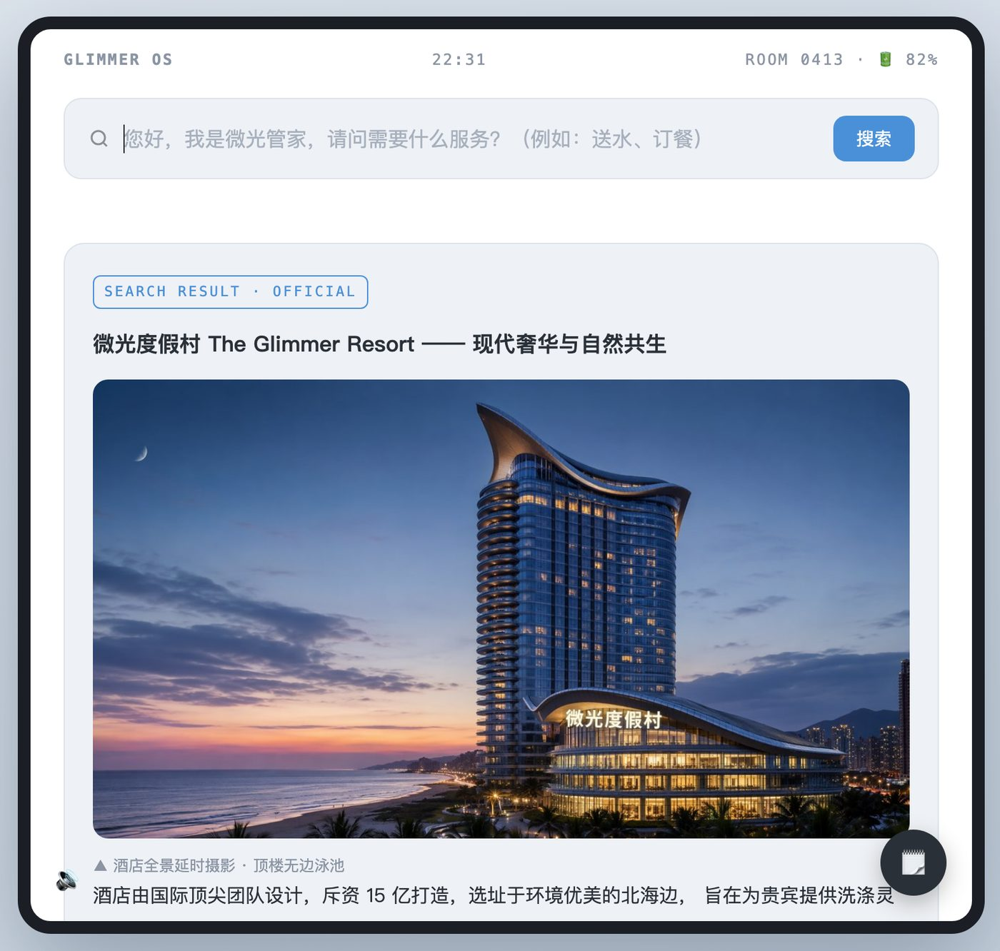
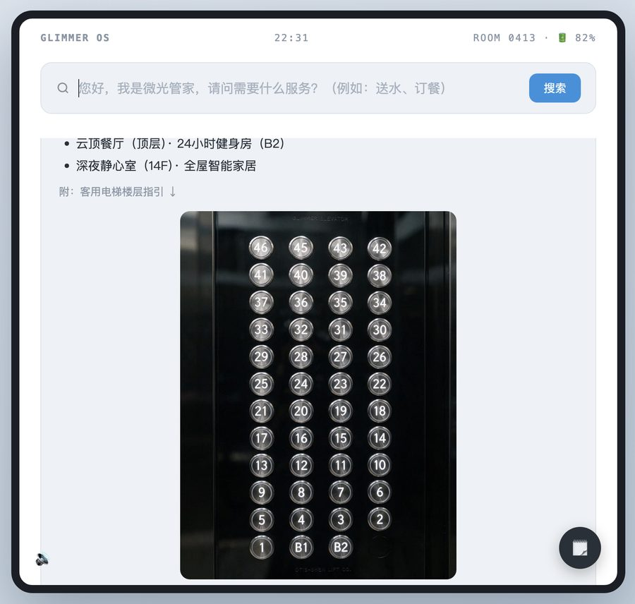
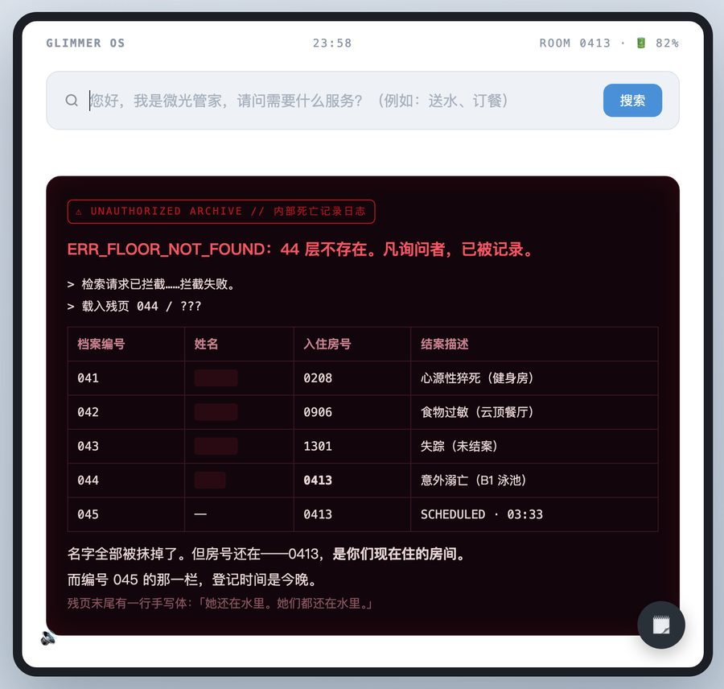
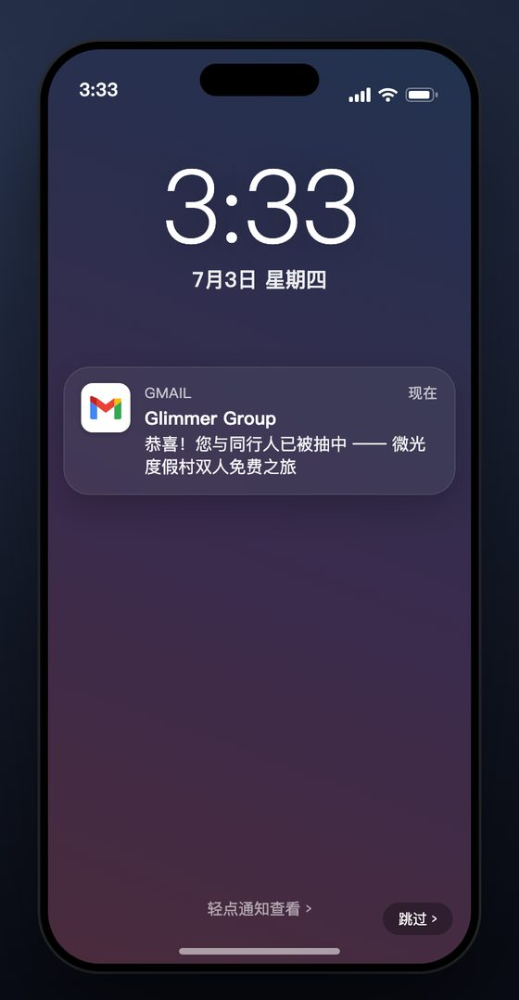
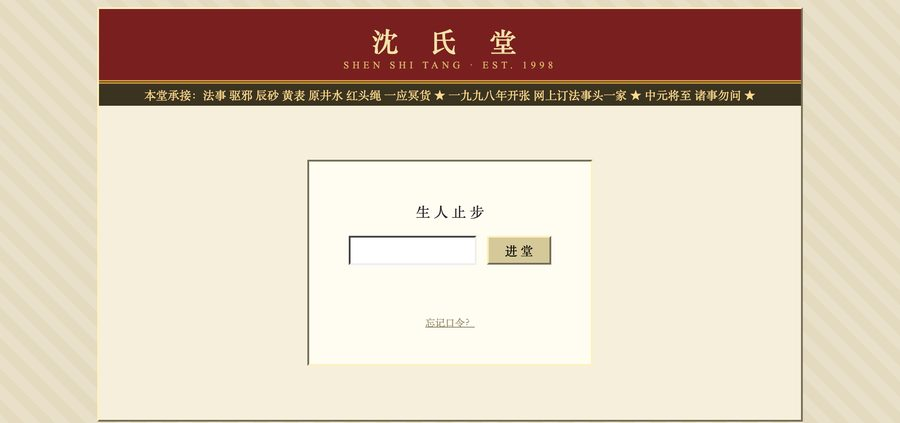

<div align="center">

# 微光度假村 · The Glimmer Resort

**一款只有一个搜索框的中文民俗恐怖解谜游戏**

### [▶ 在线试玩 glimmer.mimoris.cn](https://glimmer.mimoris.cn)

*所有进入微光的人，都将成为微光的一部分。*



</div>

---

## 怎么玩

你和女友"中奖"入住微光度假村，房间里只有一台平板、一个搜索框。

**没有按钮，没有选项，没有下一步。** 你能做的只有一件事：**看出哪里不对劲，把它输进搜索框。**
输对了，酒店的"官方"页面会被什么东西劫持，然后告诉你一点真相；输错了，微光管家会礼貌地假装听不懂。

卡住的时候在搜索框输入 **「提示」**：第一次给方向，紧接着再输一次给答案。

<table>
<tr>
<td width="50%"></td>
<td width="50%"></td>
</tr>
<tr>
<td><b>酒店有 46 层。数一遍这块面板。</b><br><sub>看出少了什么，就知道该搜什么。</sub></td>
<td><b>搜对了，页面就不再是酒店的了。</b><br><sub>九种不重样的"劫持"特效，每种只出现一次。</sub></td>
</tr>
</table>

<table>
<tr>
<td width="32%" align="center"></td>
<td width="68%">
<br><br>
<b>第三章起，会弹出第二个网站。</b><br>
<sub>一个 1998 年做的老网站，还活着，还在接单。线索在那边，答案输回这边——两个窗口的状态是实时同步的。</sub>
</td>
</tr>
<tr>
<td colspan="2"><b>序章从一条凌晨 3:33 的中奖推送开始。</b><br><sub>手机 → 邮件 → 领奖页 → 表单，然后横过来变成酒店的平板。</sub></td>
</tr>
</table>

## 章节

| | | |
|---|---|---|
| **序章** | 中奖 | 你为什么会来这儿 |
| **一章** | 初次入住 | 46 层的楼，电梯少一个键 |
| **二章** | 云顶盛宴 | 每桌一盅、必须喝完的"安神汤" |
| **三章** | 镜可照真 | 镜子里多出来的那扇门，和一个 1998 年的旧网站 |
| **四章** | 亥时·诸镜皆门 | 回魂夜。先入者为主，后入者为客 |
| **终章** | 寅时·井开三刻 | 三个结局。其中一个，得看你前面顺手做过什么 |

## 特性

- **纯前端、零依赖、零构建**：两个 HTML 文件装下全部剧情、图片、视频与音效，没有框架也没有 npm
- **单文件自包含**：19 张图 / 1 段视频 / 9 段音频全部 base64 内嵌，运行时不发一个外部请求
- **双窗口解谜**：微光管家 × 沈氏堂旧门户，靠 localStorage 跨窗口同步进度
- **九种劫持特效**：glitch / 断电 / 文字掉落 / 腐坏 / 冻结 / 静音 / 镜像 / 手电 / 水波，看过即不重播
- **音效全部手写 WebAudio**：9 个程序化音效函数；人声的"水下"音色由 lowpass + delay 实时合成，而不是烘焙进文件
- **内置线索手账、两级提示、开发者模式**（26 个存档点，进度条即时跳转任意剧情节点）

## 本地运行

```bash
git clone https://github.com/DiDiandDouDou12138/glimmer-resort.git
```

把 `index.html` 与 `shenshitang.html` 放在**同一个文件夹**里，双击 `index.html` 即可。
不需要装任何东西，也不需要起服务器。

> 建议用 Chrome / Edge / Safari 新版本。首次加载约 4.7MB（本地秒开）。

## 部署

托管在**阿里云 OSS 静态网站托管**，push 到 `main` 由 GitHub Actions 自动部署
（工作流：[`.github/workflows/deploy.yml`](.github/workflows/deploy.yml)）。

首次配置、密钥、自定义域名与证书的完整步骤，见 **[DEPLOY.md](DEPLOY.md)**。

> ⚠️ 用 OSS 的 Bucket 默认域名访问 HTML 会被强制**下载**而不是打开，
> **必须绑定自定义域名**站点才能在线游玩；国内节点还需 ICP 备案。详见 DEPLOY.md。

## ⚠️ 剧透警告

源码里能看到所有谜底与关键词表。**想玩就先玩，再看代码。**

---

<div align="center">
<sub>剧情、谜题、程序与上线均为个人独立完成 · 图片与配音由 AI 生成工具产出后人工筛选接入</sub>
</div>
